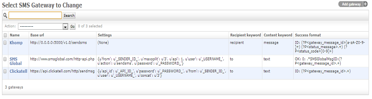

.. _SMS:

=================
SMS Configuration
=================

Configuration
=============

SMS braodcasting is supported as standard by Newfies-Dialer, allowing Newfies-Dialer to send out thousands or millions of SMS messages to  contacts.

The SMS gateway supports the following gateways, Clickatell (http://www.clickatell.com/) and SMSGlobal (http://www.smsglobal.com). Additionally, Khomp hardware is supported to allow the use of SIM cards in house. See http://www.khomp.com.br/ for more details.

Go to the Admin interface and identify the SMS Gateway section, and click on Gateways. Listed by default are three gateways, Clickatell, SMSGlobal and Khomp. Those that you don't want to be configured can be deleted.

Click the gateway to be configured and edit the pre-filled settings and populate the fields with the credentials supplied by your SMS provider:

**URL**:

    * http://localhost:8000/admin/sms/gateway/
    * http://localhost:8000/admin/sms/gateway/add/

.. image:: ../_static/images/admin/update_sms_gateway.png

Clickatell
----------

Clickatell settings::

    {
      "api_id": "_API_ID_",
      "password": "_PASSWORD_",
      "from": "_SENDER_ID_",
      "user": "_USERNAME_",
      "concat": "3"
    }

Edit _API_ID_, _Sender_ID_, _USERNAME_ and _PASSWORD_  to the credentials provided by Clickatell and leave everything else as it is, and click save.

SMSGlobal
---------

The default settings are as follows::

    {
      "from": "_SENDER_ID_",
      "maxsplit": "3",
      "api": 1,
      "user": "_USERNAME_",
      "action": "sendsms",
      "password": "_PASSWORD_"
    }

Edit _Sender_ID_, _USERNAME_ and _PASSWORD_ to match the credetials issued by SMSGlobal, leave everything else unchanged and save.

Vitelity
--------

Vitelity: http://www.vitelity.com/services_sms/

You will need to turn on API access for whatever IP your Newfies-Dialer
installation is hosted on, create a shortcode keyword, and set a default
response to that keyword.

Here it's how you should configure the new SMS Gateway to support Vitelity:

Name:
::
    SMSvitelity

Base URL:
::
    http://smsout-api.vitelity.net/api.php

Set the `Settings` as follow:
::
    {
      "xml": "yes",
      "src": "99629",
      "login": "YOUR_VITELITY_API_LOGIN",
      "cmd": "sendshort",
      "pass": "YOUR_VITELITY_API_PASSWORD"
    }

Recipient keyword:
::
    dst

Content keyword:
::
    msg

Status mapping:
::
    {
      "fail": "Error",
      "ok": "Sent"
    }

Success format:
::
    .*\n*.*\n*.*<status>(?P<status_message>.+)</status>\n*<response>(?P<status_code>.+)</response>(?P<gateway_message_id>.+)

Khomp
-----

Khomp hardware is supported to all the use of SIM cards in house. See http://www.khomp.com.br/ for more details. The hardware needs to be configured for Freeswitch, see http://wiki.freeswitch.org/wiki/Khomp for more details.

Additionally, the SMS Khomp API needs to be installed to link Newfies-Dialer and Khomp hardware which is available at https://github.com/areski/sms-khomp-api.

Contact us (http://www.newfies-dialer.org/about-us/contact/) for support and assistance.

Messages
========

The messages section in the admin screens shows the status of the messages, e.g. success or failure as well as the status message.

Providers
=========

This area is not operational at the moment and is as a place-holder for future development.

Replies
=======

This area is not operational at the moment and is as a place-holder for future development

