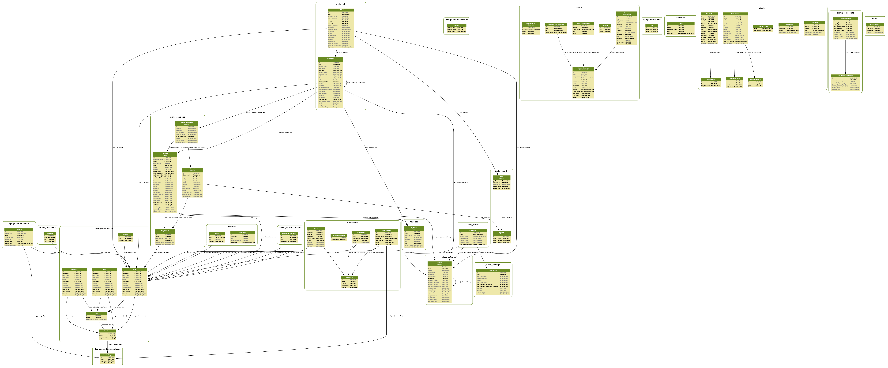

.. _objects-description:

Objects Description
===================

.. automodule:: dialer_contact.models

.. _Phonebook-model:

:class:`Phonebook`
------------------

.. autoclass:: Phonebook
    :members:

.. _Contact-model:

:class:`Contact`
----------------

.. autoclass:: Contact
    :members:

.. automodule:: dialer_campaign.models

.. _Campaign-manager-model:

:class:`CampaignManager`
------------------------

.. autoclass:: CampaignManager
    :members:

.. _Campaign-model:

:class:`Campaign`
-----------------

.. autoclass:: Campaign
    :members:

.. _Subscriber-model:

:class:`Subscriber`
-------------------

.. autoclass:: Subscriber
    :members:

.. automodule:: dialer_cdr.models

.. _Callrequest-model:

:class:`Callrequest`
--------------------

.. autoclass:: Callrequest
    :members:

.. _VoIPCall-model:

:class:`VoIPCall`
-----------------

.. autoclass:: VoIPCall
    :members:

.. automodule:: voice_app.models

.. _VoiceApp-model:

:class:`VoiceApp_abstract`
--------------------------

.. autoclass:: VoiceApp_abstract
    :members:

:class:`VoiceApp_template`
--------------------------

.. autoclass:: VoiceApp_template
    :members:

:class:`VoiceApp`
-----------------

.. autoclass:: VoiceApp
    :members:

.. automodule:: dialer_gateway.models

.. _Gateway-model:

:class:`Gateway`
----------------

.. autoclass:: Gateway
    :members:

.. automodule:: dialer_settings.models

.. _DialerSetting-model:

:class:`DialerSetting`
----------------------

.. autoclass:: DialerSetting
    :members:

.. automodule:: survey.models

.. _Survey-model:

:class:`Survey_abstract`
------------------------

.. autoclass:: Survey_abstract
    :members:

:class:`Survey_template`
------------------------

.. autoclass:: Survey_template
    :members:

:class:`Survey`
---------------

.. autoclass:: Survey
    :members:

.. _Section-model:

:class:`Section_abstract`
-------------------------

.. autoclass:: Section_abstract
    :members:

:class:`Section_template`
-------------------------

.. autoclass:: Section_template
    :members:

:class:`Section`
----------------

.. autoclass:: Section
    :members:

.. _Branching-model:

:class:`Branching_abstract`
---------------------------

.. autoclass:: Branching_abstract
    :members:

:class:`Branching_template`
---------------------------

.. autoclass:: Branching_template
    :members:

:class:`Branching`
------------------

.. autoclass:: Branching
    :members:

.. _Result-model:

:class:`Result`
---------------

.. autoclass:: Result
    :members:

.. _ResultAggregate-model:

:class:`ResultAggregate`
------------------------

.. autoclass:: ResultAggregate
    :members:

.. automodule:: user_profile.models

.. _UserProfile-model:

:class:`UserProfile`
--------------------

.. autoclass:: UserProfile
    :members:

.. _database-design:

Database Design
===============

The current database schema is shown below:

