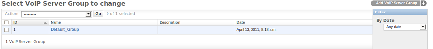
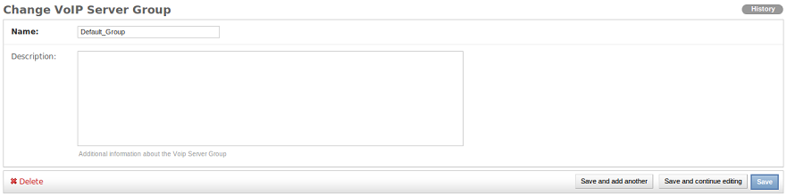
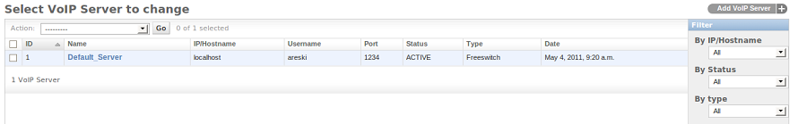

.. _admin-panel:

===========
Admin Panel
===========

http://localhost:8000/admin/

This interface provides user (ACL) management, full control of all
Campaigns, Phonebooks, Subscribers, Gateways and configuration of the
Audio Application.

.. contents::
    :local:
    :depth: 1

.. _admin-screenshot-features:

Screenshot with Features
========================

Dashboard
~~~~~~~~~

Dashboard page for admin interface after successful login with superuser credentials

.. image:: ../_static/images/admin_screenshot.png

.. _admin-phonebook-access:

Phonebook
~~~~~~~~~

Phonebook list will be displayed from following URL. You can add new phonebook
by clicking ``Add phonebook`` and add name of phonebook and its description.
Also from phonebook list, click on phonebook that you want to update.

**URL**:

    * http://localhost:8000/admin/dialer_campaign/phonebook/

.. image:: ../_static/images/admin/phonebook_list.png
    :width: 1000

To Add/Update phonebook for user

**URL**:

    * http://localhost:8000/admin/dialer_campaign/phonebook/add/
    * http://localhost:8000/admin/dialer_campaign/phonebook/1/

.. image:: ../_static/images/admin/update_phonebook.png
    :width: 1000

.. _admin-contact-access:

Contact
~~~~~~~

Contact list will be displayed from the following URL and you can add a new contact
by clicking ``Add contact`` & add contact details (like phone number, name,
description about contact, contact status) under one phonebook from phonebook list.

If the contact is active and linked phonebook is also attached with running campaign,
then the contact will be added into campaign subscribers.

From contact list, click on contact that you want to update.

**URL**:

    * http://localhost:8000/admin/dialer_campaign/contact/

.. image:: ../_static/images/admin/contact_list.png
    :width: 1000

To Add/Update contact

**URL**:

    * http://localhost:8000/admin/dialer_campaign/contact/add/
    * http://localhost:8000/admin/dialer_campaign/contact/1/

.. image:: ../_static/images/admin/update_contact.png
    :width: 1000

To import bulk contacts into phonebook, click on ``Import contacts``. 
where you can upload contacts via CSV file under one phonebook.

**URL**:

    * http://localhost:8000/admin/dialer_campaign/contact/import_contact/

.. image:: ../_static/images/admin/import_contact.png

.. _admin-campaign-access:

Campaign
~~~~~~~~

The campaign list will be displayed from following URL. You can add a new campaign 
by clicking ``Add campaign``. While adding campaign, importantly; add campaign's
start and end dates with time & week-day exception. Also select gateway
through which calls will be routed & phonebook(s) that are linked with contacts.

From campaign list, click on campaign that you want to update.

**URL**:

    * http://localhost:8000/admin/dialer_campaign/campaign/

.. image:: ../_static/images/admin/campaign_list.png
    :width: 1000

To Add/Update Campaign for user

**URL**:

    * http://localhost:8000/admin/dialer_campaign/campaign/add/
    * http://localhost:8000/admin/dialer_campaign/campaign/1/

.. image:: ../_static/images/admin/update_campaign.png
    :width: 1000

.. _admin-campaign-subscriber-access:

Campaign Subscriber
~~~~~~~~~~~~~~~~~~~

Campaign Subscriber list will be displayed from following URL. You can add
new campaign subscriber by clicking ``Add campaignsubscriber``. Also from campaign
subscriber list, click on the subscriber that you want to update.

While creating Contact, if it is active and its linked phonebook is also attached
with running campaign, then the contact will be added into campaign subscriber.

**URL**:

    * http://localhost:8000/admin/dialer_campaign/campaignsubscriber/

.. image:: ../_static/images/admin/campaignsubscriber_list.png
    :width: 1000

To Add/Update Campaign Subscriber

**URL**:

    * http://localhost:8000/admin/dialer_campaign/campaignsubscriber/add/
    * http://localhost:8000/admin/dialer_campaign/campaignsubscriber/1/

.. image:: ../_static/images/admin/update_campaignsubscriber.png
    :width: 1000

.. _admin-dialer-settings-access:

Dialer Settings
~~~~~~~~~~~~~~~

Dialer settings list will be displayed from following URL. Dialer settings list
is applied to system User. You can add new setting by clicking ``Add Dialer Settings``
and add numeric values for limit. Also from dialer settings list, click on
the setting that you want to update.

**URL**:

    * http://localhost:8000/admin/dialer_settings/dialersetting/

.. image:: ../_static/images/admin/dialersetting_list.png
    :width: 1000

To Add/Update dialer settings that are going to link with newfies user

**URL**:

    * http://localhost:8000/admin/dialer_settings/dialersetting/add/
    * http://localhost:8000/admin/dialer_settings/dialersetting/1/

.. image:: ../_static/images/admin/update_dialersetting.png
    :width: 1000

To apply dialer settings limit on User, click on ``Customers`` or ``Admins``,
select user to update & apply settings from dialer settings list.

**URL**:

    * http://localhost:8000/admin/auth/staff/1/

.. image:: ../_static/images/admin/apply_dialer_setting_to_user.png
    :width: 1000

.. _admin-dialer-gateway-access:

Dialer Gateway
~~~~~~~~~~~~~~

The Dialer Gateway list will be displayed from following URL. You can add new gateway
by clicking ``Add Dialer Gateway`` and add detail for it (like gateway name, hostname, 
protocol etc.). Also from gateway list, click on the gateway that you want to update.

**URL**:

    * http://localhost:8000/admin/dialer_gateway/gateway/

.. image:: ../_static/images/admin/gateway_list.png
    :width: 1000

To Add/Update dialer gateway

**URL**:

    * http://localhost:8000/admin/dialer_gateway/gateway/add/
    * http://localhost:8000/admin/dialer_gateway/gateway/1/

.. image:: ../_static/images/admin/update_gateway.png
    :width: 1000

.. _admin-voip-app-access:

VoIP Application
~~~~~~~~~~~~~~~~

VoIP application list will be displayed from following URL. You can add a new
application by clicking ``Add VoIP Application``. Also from application list,
click on the application that you want to update.

**URL**:

    * http://localhost:8000/admin/voip_app/voipapp/

.. image:: ../_static/images/admin/voipapp_list.png
    :width: 1000

To Add/Update VoIP application

**URL**:

    * http://localhost:8000/admin/voip_app/voipapp/add/
    * http://localhost:8000/admin/voip_app/voipapp/1/

.. image:: ../_static/images/admin/update_voipapp.png
    :width: 1000

.. _admin-voip-server-group-access:

VoIP Server Group
~~~~~~~~~~~~~~~~~

VoIP server group list will be displayed from following URL. You can add a new group
by clicking ``Add VoIP Server Group``. Also from group list, click on the group
that you want to update.

**URL**:

    * http://localhost:8000/admin/voip_server/voipservergroup/

To Add/Update VoIP Server Group

**URL**:

    * http://localhost:8000/admin/voip_server/voipservergroup/add/
    * http://localhost:8000/admin/voip_server/voipservergroup/1/

.. _admin-voip-server-access:

VoIP Server
~~~~~~~~~~~

VoIP server list will be displayed from following URL. You can add new server
by clicking ``Add VoIP Server`` and add details like server name, IP address,
server username, password, port no etc.. Also from server list, click on the server
that you want to update.

**URL**:

    * http://localhost:8000/admin/voip_server/voipserver/

To Add/Update VoIP Server

**URL**:

    * http://localhost:8000/admin/voip_server/voipserver/add/
    * http://localhost:8000/admin/voip_server/voipserver/1/

.. image:: ../_static/images/admin/update_voipserver.png
    :width: 1000

.. _admin-call-request-access:

Call Request
~~~~~~~~~~~~

Call Request list will be displayed from following URL. You can add new call request
by clicking ``Add Call Request``. Also from call request list, click on the
request that you want to update.

**URL**:

    * http://localhost:8000/admin/dialer_cdr/callrequest/

.. image:: ../_static/images/admin/callrequest_list.png
    :width: 1000

To Add/Update Call Request

**URL**:

    * http://localhost:8000/admin/dialer_cdr/callrequest/add/
    * http://localhost:8000/admin/dialer_cdr/callrequest/1/

.. image:: ../_static/images/admin/update_callrequest.png
    :width: 1000

VoIP Call Report
~~~~~~~~~~~~~~~~

VoIP Call list will be displayed from following URL. You **can not** add new call report.

**URL**:

    * http://localhost:8000/admin/dialer_cdr/voipcall/

image coming soon ...