.. _admin-panel:

===========
Admin Panel
===========

http://localhost:8000/admin/

This interface provides user (ACL) management, full control of all
Campaigns, Phonebooks, Subscribers, Gateways and configuration of the
Audio Application.

.. contents::
    :local:
    :depth: 1

.. _admin-screenshot-features:

Screenshot with Features
========================

Dashboard
~~~~~~~~~

Dashboard page for the admin interface after successful login with superuser credentials

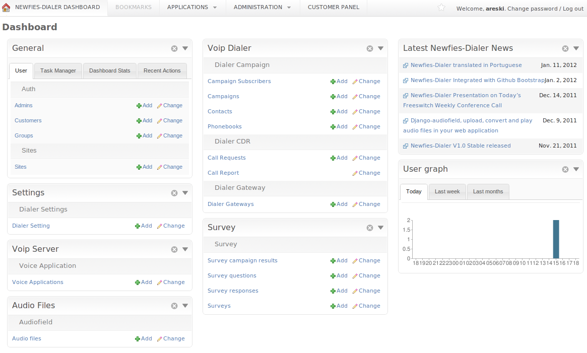

Admin
~~~~~

The Admin section allows you to create administrators who have access the admin screens. Levels of
access can be set. If the administrator is to be allowed to make calls, then a gateway and dialer-
settings must be set for that administrator.

Customers
~~~~~~~~~

Customers only have access to the customer panel. Before a customer can make calls, they must have
both dialer-settings and a gateway attached to their account.

Sites
~~~~~

Some of the features of Newfies-Dialer are dependent on the hostname or IP address, so this has to
be set correctly in site address.

In the Admin dashboard, locate the “Sites” link and click change. By default, there will be an entry
of “example.com”. Edit this setting to reflect the hostname of the server, or if you do not have
this set up, the IP address. e.g.  http://www.domain.tld:8008 or in the case of an IP address,
http://192.168.1.200:8008

	* http://localhost:8000/admin/sites/

.. _admin-phonebook-access:

Phonebook
~~~~~~~~~

The phonebook list will be displayed from the following URL. You can add a new
phonebook by clicking ``Add phonebook`` and adding the name of the phonebook and its
description, Also from the phonebook list, click on the phonebook that you want
to update.

**URL**:

    * http://localhost:8000/admin/dialer_campaign/phonebook/

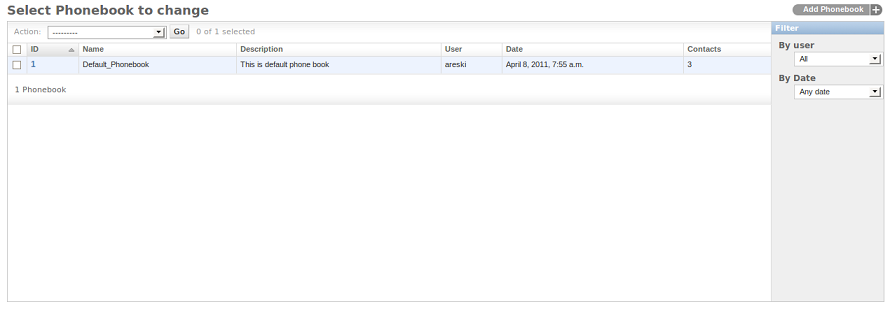
    

To Add/Update phonebook for a user

**URL**:

    * http://localhost:8000/admin/dialer_campaign/phonebook/add/
    * http://localhost:8000/admin/dialer_campaign/phonebook/1/

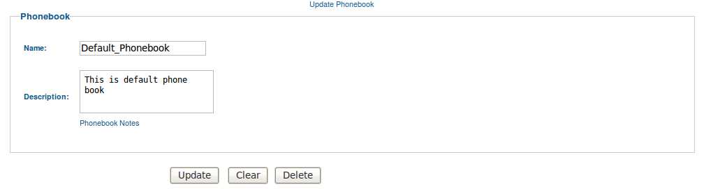
    

.. _admin-contact-access:

Contact
~~~~~~~

The contact list will be displayed from the following URL and you can add a new contact
by clicking ``Add contact`` & adding the contact details (i.e. phone number, name,
description about contact, contact status) to one phonebook from the phonebook list.

If the contact is active and the linked phonebook is also attached to a running campaign,
then the contact will be added into subscriber.

From the contact list, click on the contact that you want to update.

**URL**:

    * http://localhost:8000/admin/dialer_campaign/contact/

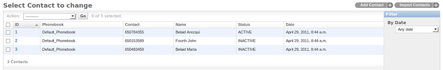
    

To Add/Update a contact

**URL**:

    * http://localhost:8000/admin/dialer_campaign/contact/add/
    * http://localhost:8000/admin/dialer_campaign/contact/1/

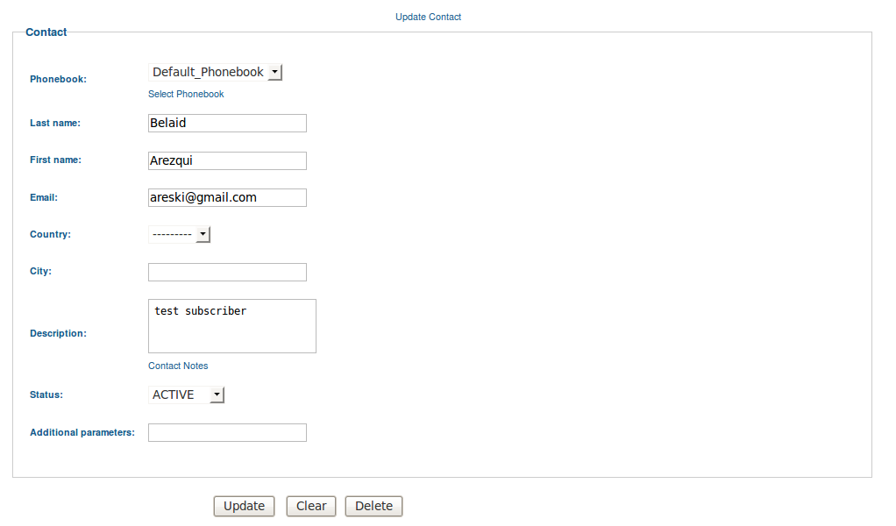
    

To import bulk contacts into a phonebook, click on ``Import contacts``.
where you can upload the contacts via a CSV file in to one phonebook.

**URL**:

    * http://localhost:8000/admin/dialer_campaign/contact/import_contact/

.. image:: ../_static/images/admin/import_contact.png

.. _admin-campaign-access:

Campaign
~~~~~~~~

The campaign list will be displayed from the following URL. You can add a new campaign
by clicking ``Add campaign``. While adding a campaign, it is important to add campaign's
start and end dates with time & week-day exceptions. Also select the gateway
through which calls will be routed & the phonebook(s) linked with contacts.

From the campaign list, click on the campaign that you want to update.

**URL**:

    * http://localhost:8000/admin/dialer_campaign/campaign/

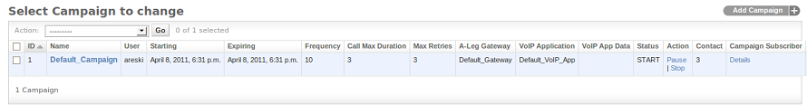
    

To Add/Update Campaign for user

**URL**:

    * http://localhost:8000/admin/dialer_campaign/campaign/add/
    * http://localhost:8000/admin/dialer_campaign/campaign/1/

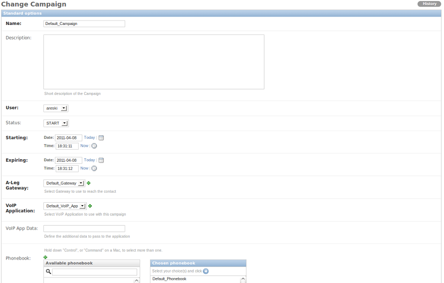
    

.. _admin-subscriber-access:

Subscriber
~~~~~~~~~~

The Subscriber list will be displayed from the following URL. You can add
a new subscriber by clicking ``Add Subscriber``. Also from the campaign
subscriber list, click on the subscriber to update.

While creating a contact, if its linked phonebook is also attached
to a running campaign, then the contact will be added into the subscriber.

**URL**:

    * http://localhost:8000/admin/dialer_campaign/campaignsubscriber/

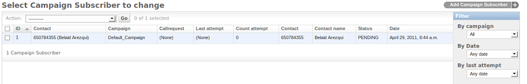
    

To Add/Update Subscriber

**URL**:

    * http://localhost:8000/admin/dialer_campaign/campaignsubscriber/add/
    * http://localhost:8000/admin/dialer_campaign/campaignsubscriber/1/

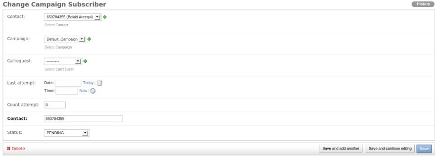
    

.. _admin-dialer-settings-access:

Dialer Settings
~~~~~~~~~~~~~~~

The dialer settings list will be displayed from the following URL. The Dialer settings
list is applied to a system User. You can add a new setting by clicking ``Add Dialer Settings``
and add numeric values for the limit. Also from the dialer settings list, click on
the setting to update.

**URL**:

    * http://localhost:8000/admin/dialer_settings/dialersetting/

.. image:: ../_static/images/admin/dialersetting_list.png
    

To Add/Update dialer settings for a Newfies-Dialer user

**URL**:

    * http://localhost:8000/admin/dialer_settings/dialersetting/add/
    * http://localhost:8000/admin/dialer_settings/dialersetting/1/

.. image:: ../_static/images/admin/update_dialersetting.png
    

To apply dialer settings limit to a User, click on ``Customers`` or ``Admins``,
select the user to be updated & apply settings from the dialer settings list.

**URL**:

    * http://localhost:8000/admin/auth/staff/1/

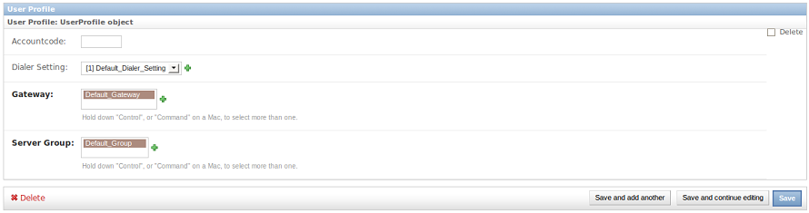
    

.. _admin-dialer-gateway-access:

Dialer Gateway
~~~~~~~~~~~~~~

The Dialer Gateway list will be displayed from the following URL. You can add a new gateway
by clicking ``Add Dialer Gateway`` and adding the details (e.g. gateway name, hostname,
protocol etc.). Also from the gateway list, click on the gateway that you want to update.

**URL**:

    * http://localhost:8000/admin/dialer_gateway/gateway/

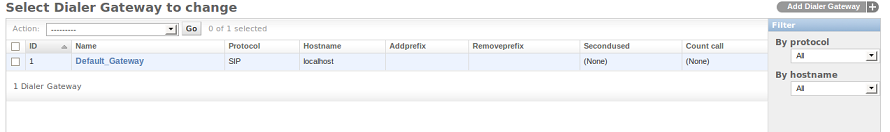
    

To Add/Update a dialer gateway

**URL**:

    * http://localhost:8000/admin/dialer_gateway/gateway/add/
    * http://localhost:8000/admin/dialer_gateway/gateway/1/

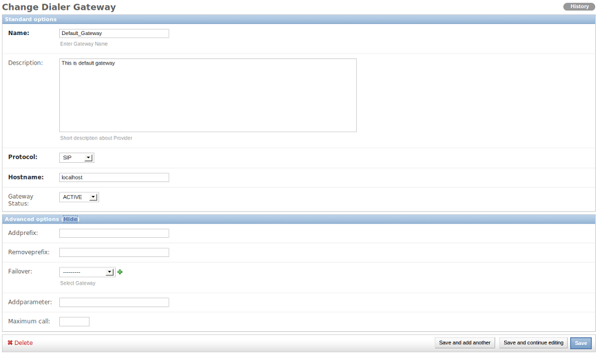
    

.. _admin-survey-access:

Survey
~~~~~~

The survey application for Newfies-Dialer allows polls and surveys to be taken over the phone.

Each contact is called, and then played a sound file. After the sound file is heard, the user can
enter their answer through the phone keypad using keys 0 to 9.

Therefore before creating the survey, the first job is to upload the audio for the survey. One audio
file is required for each question.

 **Add Audio File**

CLick Audio Files, then click Add.

Give the audio file a descriptive name, chose the file to upload.

In the Admin screens, there are options to convert to other formats, change the number of channels,
e.g. change from stereo to mono, and down-sample the frequency. Finally, the user can be assigned.

 **Survey Admin Functions**

From the admin screen, Surveys can be added, deleted and edited. Additionally, survey questions can
be re-ordered.

**URL**:

    * http://localhost:8000/admin/survey/surveyapp/

.. image:: ../_static/images/admin/survey_list.png
    

To Add/Update a survey

**URL**:

    * http://localhost:8000/admin/survey/surveyapp/add/
    * http://localhost:8000/admin/survey/surveyapp/1/

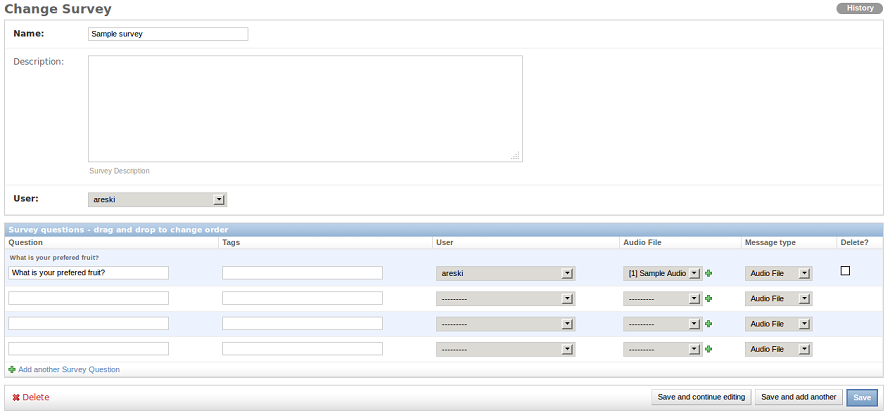
    

To Add/Update a survey question

    * http://localhost:8000/admin/survey/surveyquestion/add/
    * http://localhost:8000/admin/survey/surveyquestion/1/

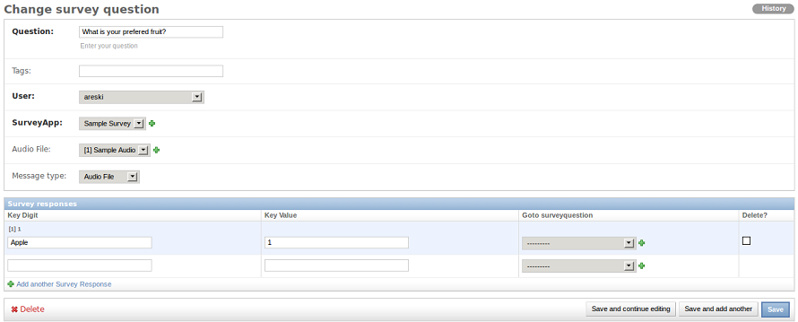
    

When the survey is complete, the results can be inspected.

 	* http://localhost:8000/admin/survey/surveycampaignresult/

.. _admin-call-request-access:

Call Request
~~~~~~~~~~~~

The call request list will be displayed from the following URL. You can add a
new call request by clicking ``Add Call Request``. Also from the call request list,
click on the request to update.

**URL**:

    * http://localhost:8000/admin/dialer_cdr/callrequest/

.. image:: ../_static/images/admin/callrequest_list.png
    

To Add/Update a Call Request

**URL**:

    * http://localhost:8000/admin/dialer_cdr/callrequest/add/
    * http://localhost:8000/admin/dialer_cdr/callrequest/1/

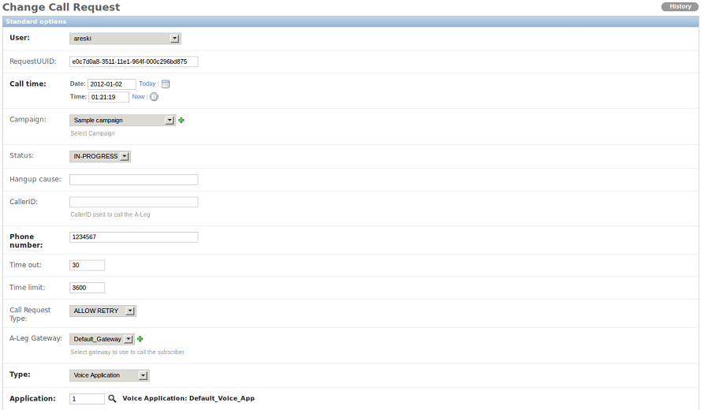
    

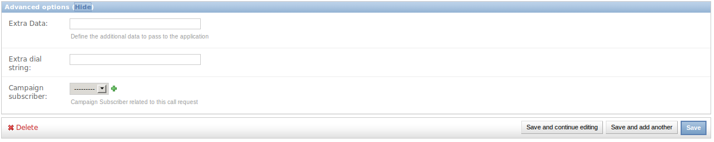
    

VoIP Call Report
~~~~~~~~~~~~~~~~

A VoIP Call list will be displayed from following URL. You **can not** add new call reports.

**URL**:

    * http://localhost:8000/admin/dialer_cdr/voipcall/

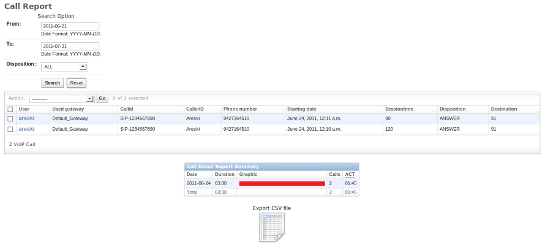
    
