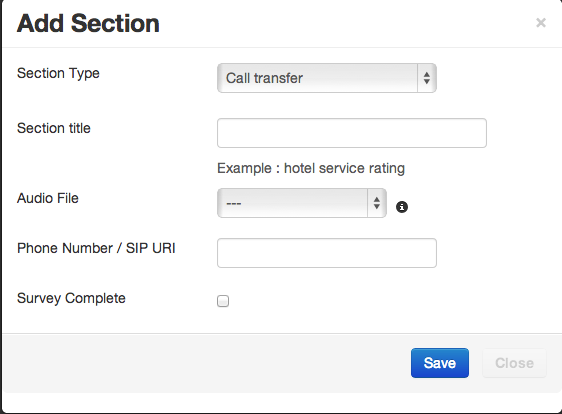

.. _appointment-module:

==================
Appointment Module
==================

.. contents::
    :local:
    :depth: 2

Starting at the version 2.10, Newfies-Dialer has been enhanced with an appointment module. Newfies-Dialer was at first designed for voice broadcasting and this allowed to efficiently outbound thousands and millions of calls via gateway to an audience. One of the major limitation of the Voice Broadcasting, it's that it's very complex to target a call to a specific contact at a programmed time. This is where the appointment module fill up the gap.

What is offered by the appointment module?

The module is composed of new elements :

- Calendar User, which are subuser of the Newfies-Dialer User

- Calendar, those helps to collect set of events happening at certain time.

- Event, this is something occuring at a certain time for a defined period of time, an event can have programmed reoccurence and so repeat itself every day, every month, or follow complex rules like repeating itself every week but only Tuesday.

- Rule, which define the rule to follow for the reoccurence of Event

- Alarm, this defines the alarm link to an event, Alarm can happen via different method, the supported are Call, SMS and Mail. Alarms can have repeatition programmed in case of failure, retry x times to reach a person, define the delay between alarm. It goes even deeper, you could program action when alarm success or when they fail. Alarm have several features which we will describe in details later.

This diagram of the appointment models might help developers and integrators helps to understand the system.
[ADD IMAGE]

.. _appointment-user-cases:

User cases
----------

The appointment modules has been build with flexibility from day one, and try to cover scenarios needed by different applications/softwares in need of performing complex Appointment reminders application or Alarm system.

You could build with this module software such:

- Wakeup call alarm, each of your calendar user will have their calendar in which they will create an wakeup event, decide when it will be triggered, how many times, delay between retries, etc...

The voice application will then play something like "Hello Mr Joe, it's 7am and it's time for you to wake up and get ready for work"

- Appointment Reminder, imagine your users are doctors with cabinet and they need to call their patient 24 hours before each appointment,
they want to offer an application that will call their patient and say "Hello, you have an appointment tomorrow with Doctor {doc_name} at {apt_date}, please press 1 to confirm, press 2 to cancel or press 3 to reschedule"

When the user press any key during a Rating type of Node on the IVR application, this is considered as result and will be store to the alarm result field. If the patient press 2, you will see this in the result and could display this to the doctor, if the user press 3 you could decide to transfer the call to the secretary.

Appointment module support Call, SMS and mail, so you can decide to send a passive SMS as an extra reminder an hour before appointment.

- Calendar Alarm event, this module can also be use by users that want to simply remember important event in their day to day life, meeting, pickup the kid from music class, etc... each Calendar user can create as many calendar as they want, for instance they could have a birthday calendar and a work calendar to not mix personal and professional event.

.. _appointment-event:

Events explained
----------------

more details about Events

.. _appointment-alarm:

Alarms explained
----------------

more details about Alarms

.. _appointment-rule:

Rules explained
---------------

more details about Rules

.. _appointment-calendar-user:

Calendar User explained
-----------------------

Calendar User are sub user to the Newfies users which are themselves under the manager user and admin users.
Calendar User have a simple roles, create calendar, events and set alarms, then they should be able to access the result of this data.

We don't provide all UI for you to start building an appointment reminder application for your user, but we do provide an extensive list of APIs which will help you to make this job seamlessly.

.. _appointment-work-flow:

Work Flow
---------

To be able to setup and recieve alarm there is a work flow to follow, which we will described bellow:

1) Create Calendar User, set credentials and permission for this user

2) Create Calendar, give it a name

3) Create Event...

4) Create create a IVR application (Survey) that will be use and play to the user receiving the calls...

5) Seal the IVR application (Survey)

6) Create Alarm...
configure alarm...

7) Access result Alarmrequest

.. _appointment-work-flow-api:

Work Flow with API
------------------

We will describe here for integrator an example of workflow with APIs.

