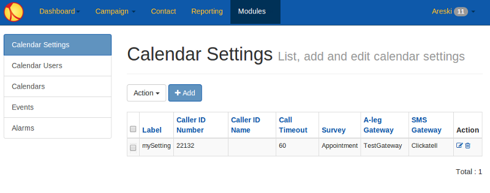
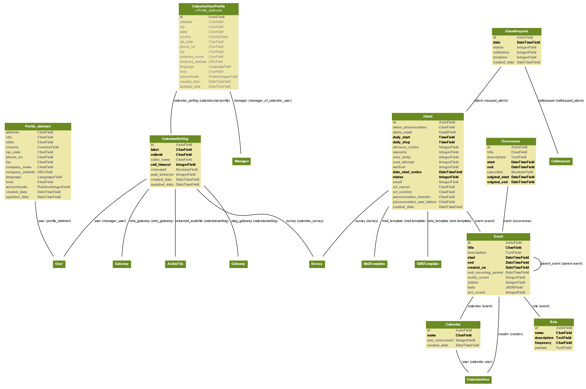

.. _appointment-module:

==================
Appointment Module
==================

.. contents::
    :local:
    :depth: 2

Starting from the version 2.10, Newfies-Dialer has been enhanced with an appointment module. At first Newfies-Dialer was designed to provide a powerful voice broadcasting and it efficiently outbound thousands and millions of calls via gateway to different audience. One of the major limitation of the voice broadcasting, it's impossible/hard to target a call to a specific contact at a *programmed time*. This is where the appointment module fill up the gap and allow to build outbound calls application depending on time-stamp.

.. _appointment-structure:

Structure of the appointment module
-----------------------------------

The module have few components will we will describe in this section.

**Calendar User**

    The Calendar User is sub-user of the Newfies-Dialer User, calendar user will be your end-user which will need to set reminders/alarms.
    For instance if you provide appointment reminder to doctor, the calendar user may be the doctor or the secretary.
    A Calendar User have a certain amount of limitation which are configured via Calendar User Settings.

**Calendar**

    Calendar are entity that help to regroup and collect events.

**Event**

    Event, it's a thing that happen/occur at a certain date & time, an event is link to a Calendar. You can define the duration of an event (ie hour),  you can also by the mean of Rule configure occurence mechanism, for instance if an event is happening every day, every month, or event follow complex rules like repeating itself every week but only on Tuesday.

    TODO: add documentation on data fields (similar to additionals_data)

**Rule**

    Newfies-Dialer comes with a set of predefined rules which can be used for your event, you will find the Daily rule, which if applied to an event will make the occur every day.
    Rule is based on the rrule python module. The rrule module offers a small, complete, and very fast, implementation of the recurrence rules documented in the iCalendar RFC : http://www.ietf.org/rfc/rfc2445.txt

    More info about rrule: http://labix.org/python-dateutil#head-470fa22b2db72000d7abe698a5783a46b0731b57

Event happens at a certain time and you can also program event to occur daily or follow occurence rules, now in order to get notification about event you have to create Alarms related to the event.

**Alarm**

    Alarm helps to notify about an occurring event, the notification use several different method, the currently supported ones are Call, SMS and Mail. Alarms have a large set of settings which offers a great flexibility.

**Settings of Alarms**

    - Method : Set the method to use for an Alarm (Call, SMS or Mail)

    - Date start notice : Date to which you will start the alarm (this will generally be similar to the event date)

    - Alarm Phone Number : Define to which phone number the alarm will be trigger

    - Alarm Email : Define to which email the alarm will be sent

    - Daily start &  Daily stop : You can configure when alarm are allowed to occur during the day, for instance if you don't want alarm happening before 6am.

    - Advance Notice : How much time before the alarm occur to you want to start the notification

    - Max Retry : For call method sometime you might not reach the person, so you with max retry define the amount of retry attempts you will do.

    - Retry Delay : Time to wait between each call retry

    - Phone Number SMS Failure : In case the phone number wasn't reachable after max retry, we will trigger an SMS to this number

    - URL Cancel / URL Confirm / Phone Number Transfer : Features that will be implemented in the future version

**Alarm Result**

    TODO: Explain how alarm result works!

**Alarm Requests**

    Keep track of the alarms attempts, it's useful resources if you want to provide detailed logs.

**Calendar User Settings**

    When you create a Calendar User, there is certainly a level of customization you will need to apply for customers but most of all ensure,
    they are limited to use the Newfies-Dialer platform according to your rule.
    So for each Calendar User you will be able to set settings allowing you to preconfigure callerid, timeout on call, AMD (if you have the AMD module), the gateways that will be used for Call and for SMS and also the IVR application that they will be authorized to use.

.. _appointment-models:

Models description
------------------

This diagram of the appointment models might help developers and integrators helps to understand the system.

Explore the `appointment models`_.

.. _appointment models: ../_static/images/models/appointment.png

.. _appointment-user-cases:

User cases
----------

The appointment modules has been build with flexibility in mind, and we tried to cover several scenarios needed by different application/software willing to perform complex Appointment reminder application or Alarm system.

You could build with this module software such:

Wake up call alarm
~~~~~~~~~~~~~~~~~

    Each of your calendar user will have their calendar in which they will create an wake up event, decide when it will be triggered, how many times, delay between retries, etc...

    The voice application will then play something like "Hello Mr Joe, it's 7am and it's time for you to wake up and get ready for work"

Appointment Reminder
~~~~~~~~~~~~~~~~~~~~

    In a common appointment reminder scenario, your user could be doctors with cabinet and they need to call their patient 24 hours before each appointment, they want to offer an application that will call their patient and say "Hello, you have an appointment tomorrow with Doctor {doc_name} at {apt_date}, please press 1 to confirm, press 2 to cancel or press 3 to reschedule"

    When the user press any key during a Rating type of Node on the IVR application, this is considered as result and will be store to the alarm result field. If the patient press 2, you will see this in the result and could display this to the doctor, if the user press 3 you could decide to transfer the call to the secretary.

    Appointment module support Call, SMS and Mail, so you can decide to send a passive SMS as an extra reminder an hour before appointment.

Calendar Alarm event
~~~~~~~~~~~~~~~~~~~~

    Some users might want to simply remember important date/event, for instance for a meeting, to pickup the kid from music class, etc... each Calendar User can create as many Calendar as they want, for instance they could have a birthday calendar and a work calendar to not mix personal and professional event.

.. _appointment-process-flow:

Process flow
------------

To be able to setup and receive alarm there is a process to follow, which we will described bellow:

1) Create and Configure Voice Gateway and SMS gateway

    You should be able to do this via the admin panel:
    http://127.0.0.1:8000/admin

2) Create create a IVR application (Survey) that will be use and play to the user receiving the calls

    Go to the survey module and start creating your own application with several IVR nodes:
    http://127.0.0.1:8000/module/survey/

3) Seal a Survey, sealing a survey is important as it will ensure that if someone modify the Survey the sealed survey will not be modified and we can build accurate reporting on each survey nodes/

    There is a button in the Action column that will allow you to seal the survey:
    http://127.0.0.1:8000/module/survey/

4) Create Calendar User Settings, define a callerID and configure the gateway you want to use

    Add a new Calendar Settings here:
    http://127.0.0.1:8000/module/calendar_setting/

5) Create Calendar User, set credentials and permission for this user and assign them to a Calendar User Settings

    Create a user with a username & password:
    http://127.0.0.1:8000/module/calendar_user/

6) Create Calendar and give it a name:

    http://127.0.0.1:8000/module/calendar/

7) Create Event, for instance an event happening today at 11am, define when the event start and finish, add an occurence rule if you want for instance the event happening every day.

    Create Event can be done by click on Add button :
    http://127.0.0.1:8000/module/event/

8) Create Alarm, this will allow to receive notification when Events are occurring. To get started, let's create an alarm with Method Call, link it to the previous created event, et a date for the alarm and the phone number that will be notified, then configure the rest of the alarm settings to your taste.

    Create Alarm can be done by click on Add button :
    http://127.0.0.1:8000/module/alarm/

9) Access result Alarmrequest.

    You access to detailed logs of the Alarm happening by browsing the alarm request :
    http://127.0.0.1:8000/admin/appointment/alarmrequest/

.. _appointment-work-flow-api:

Work Flow with API
------------------

One of the powerful features of the appointment module is his APIs, which will allow developers to build great idea for application on top of Newfies-Dialer.

We will describe an example of work flow with APIs.

1) Create Calendar Setting
~~~~~~~~~~~~~~~~~~~~~~~~~~

    **CURL Usage**::

        curl -u username:password --dump-header - -H "Content-Type:application/json" -X POST --data '{"label": "cal_setting", "callerid": "123456", "caller_name": "xyz", "user": "http://127.0.0.1:8000/rest-api/user/2/", "survey": "http://127.0.0.1:8000/rest-api/sealed-survey/1/", "aleg_gateway": "http://127.0.0.1:8000/rest-api/gateway/1/", "sms_gateway": "http://127.0.0.1:8000/rest-api/sms-gateway/1/"}' http://localhost:8000/rest-api/calendar-setting/

    **Result**::

        HTTP/1.0 201 CREATED
        Date: Mon, 16 Dec 2013 11:19:30 GMT
        Server: WSGIServer/0.1 Python/2.7.3
        Vary: Accept, Accept-Language, Cookie
        Content-Language: en
        Content-Type: application/json; charset=utf-8
        Location: http://localhost:8000/rest-api/calendar-setting/3/
        Allow: GET, POST, HEAD, OPTIONS

        {
          "user": "manager",
          "sms_gateway": "http://localhost:8000/rest-api/sms-gateway/1/",
          "url": "http://localhost:8000/rest-api/calendar-setting/3/",
          "label": "cal_setting",
          "callerid": "123456",
          "caller_name": "xyz",
          "call_timeout": 60,
          "survey": "http://localhost:8000/rest-api/sealed-survey/1/",
          "aleg_gateway": "http://localhost:8000/rest-api/gateway/1/",
          "voicemail": false,
          "amd_behavior": 1,
          "voicemail_audiofile": null,
          "created_date": "2013-12-16T11:19:29.994Z",
          "updated_date": "2013-12-16T11:19:29.994Z"
        }

2) Create Calendar User
~~~~~~~~~~~~~~~~~~~~~~~

    **CURL Usage**::

        curl -u username:password --dump-header - -H "Content-Type:application/json" -X POST --data '{"username": "caluser3", "password": "caluser3", "email": "caluser3@gmail.com"}' http://localhost:8000/rest-api/calendar-user/

    **Result**::

        HTTP/1.0 201 CREATED
        Date: Mon, 16 Dec 2013 11:20:33 GMT
        Server: WSGIServer/0.1 Python/2.7.3
        Vary: Accept, Accept-Language, Cookie
        Content-Language: en
        Content-Type: application/json; charset=utf-8
        Location: http://localhost:8000/rest-api/calendar-user/6/
        Allow: GET, POST, HEAD, OPTIONS

        {
          "url": "http://localhost:8000/rest-api/calendar-user/6/",
          "username": "caluser3",
          "password": "pbkdf2_sha256$12000$Rb78UOwQeL2T$YWWy02zcxtFTIDG0ac4lJ7i9jtUbK7FCG1IkgARDVAE=",
          "last_name": "",
          "first_name": "",
          "email": "caluser3@gmail.com",
          "groups": []
        }

3) Update Calendard User Profile
~~~~~~~~~~~~~~~~~~~~~~~~~~~~~~~~

    We will need to use the previously created Calendar Setting.

    **CURL Usage**::

        curl -u username:password --dump-header - -H "Content-Type: application/json" -X PATCH --data '{"accountcode": "35365532", "calendar_setting": "3"}' http://localhost:8000/rest-api/calendar-user-profile/6/

    **Result**::

        HTTP/1.0 200 OK
        Date: Mon, 16 Dec 2013 11:23:44 GMT
        Server: WSGIServer/0.1 Python/2.7.3
        Vary: Accept, Accept-Language, Cookie
        Content-Type: application/json; charset=utf-8
        Content-Language: en
        Allow: GET, PUT, PATCH, DELETE, HEAD, OPTIONS

        {
          "manager": "manager",
          "id": 4,
          "user": 6,
          "address": null,
          "city": null,
          "state": null,
          "country": "",
          "zip_code": null,
          "phone_no": null,
          "fax": null,
          "company_name": null,
          "company_website": null,
          "language": null,
          "note": null,
          "accountcode": 35365532,
          "created_date": "2013-12-16T11:20:33.456Z",
          "updated_date": "2013-12-16T11:23:44.342Z",
          "calendar_setting": 3
        }

4) Create a new Calendar
~~~~~~~~~~~~~~~~~~~~~~~~

    We will call the new calendar "myCalendar"

    **CURL Usage**::

        curl -u username:password --dump-header - -H "Content-Type:application/json" -X POST --data '{"name": "mynewcalendar", "max_concurrent": "1", "user": "http://127.0.0.1:8000/rest-api/calendar-user/6/"}' http://localhost:8000/rest-api/calendar/

    **Result**::

        HTTP/1.0 201 CREATED
        Date: Mon, 16 Dec 2013 11:25:01 GMT
        Server: WSGIServer/0.1 Python/2.7.3
        Vary: Accept, Accept-Language, Cookie
        Content-Language: en
        Content-Type: application/json; charset=utf-8
        Location: http://localhost:8000/rest-api/calendar/4/
        Allow: GET, POST, HEAD, OPTIONS

        {
          "url": "http://localhost:8000/rest-api/calendar/4/",
          "name": "mynewcalendar",
          "user": "http://localhost:8000/rest-api/calendar-user/6/",
          "max_concurrent": 1,
          "created_date": "2013-12-16T11:25:01.378Z"
        }

5) Create a new Event
~~~~~~~~~~~~~~~~~~~~~

    We will create a new event in the previous created Calendar "myCalendar".

    **CURL Usage**::

        curl -u username:password --dump-header - -H "Content-Type:application/json" -X POST --data '{"title": "event_with_new_title", "start": "2013-12-10 12:34:43", "end": "2013-12-15 14:43:32", "creator": "http://127.0.0.1:8000/rest-api/calendar-user/6/", "end_recurring_period": "2013-12-27 12:23:34", "calendar": "http://127.0.0.1:8000/rest-api/calendar/4/", "status": "1"}' http://localhost:8000/rest-api/event/

    **Result**::

        HTTP/1.0 201 CREATED
        Date: Mon, 16 Dec 2013 11:26:56 GMT
        Server: WSGIServer/0.1 Python/2.7.3
        Vary: Accept, Accept-Language, Cookie
        Content-Language: en
        Content-Type: application/json; charset=utf-8
        Location: http://localhost:8000/rest-api/event/3/
        Allow: GET, POST, HEAD, OPTIONS

        {
          "url": "http://localhost:8000/rest-api/event/3/",
          "title": "event_with_new_title",
          "description": null,
          "start": "2013-12-10T12:34:43",
          "end": "2013-12-15T14:43:32",
          "creator": "http://localhost:8000/rest-api/calendar-user/6/",
          "created_on": "2013-12-16T11:26:56.056Z",
          "end_recurring_period": "2013-12-27T12:23:34",
          "rule": null,
          "calendar": "http://localhost:8000/rest-api/calendar/4/",
          "notify_count": 0,
          "status": 1,
          "data": null,
          "parent_event": null,
          "occ_count": 0
        }

6) Get list of child from an event
~~~~~~~~~~~~~~~~~~~~~~~~~~~~~~~~~~~

    Events, occurring in time, will have a tail of sub events linked to the parent event.
    Usually the integrator using APIs will keep track of the parent event and at some stage might need to retrieve information about the
    sub events.

    You will achieve this by using the API /get_list_child/

    **CURL Usage**::

        curl -u username:password -H 'Accept: application/json' http://localhost:8000/rest-api/event/5/get_list_child/

    **Result**::

        HTTP/1.0 200 OK
        Date: Thu, 19 Dec 2013 16:37:22 GMT
        Server: WSGIServer/0.1 Python/2.7.3
        Vary: Accept, Accept-Language, Cookie
        Content-Type: application/json
        Content-Language: en
        Allow: GET, HEAD, OPTIONS
        Set-Cookie:  sessionid=lklh4z9cop3jhh48n9i9ioe2wkp8simx; expires=Thu, 02-Jan-2014 16:37:22 GMT; httponly; Max-Age=1209600; Path=/

        {
          "url": "http://localhost:8000/rest-api/event/11/",
          "start": "2013-12-17 16:26:07+00:00",
          "end": "2013-12-17 17:26:07+00:00",
          "description": "",
          "title": "EventTitle"
        }

7) Update the last child event status to Paused
~~~~~~~~~~~~~~~~~~~~~~~~~~~~~~~~~~~~~~~~~~~~~~~

    In some scenario you might want to pause an alarm of being trigged, as an alarm is link to all occurence of an events created,
    you don't need to update the status of the parent event neither all the child, you will need to update it for the last event only.

    You will achieve this by using the API /update_last_child_status/

    **CURL Usage**::

        curl -u username:password --dump-header - -H "Content-Type: application/json" -X PATCH --data '{"status": "3"}' http://127.0.0.1:8000/rest-api/event/5/update_last_child_status/

    **Result**::

        HTTP/1.0 200 OK
        Vary: Accept, Accept-Language, Cookie
        Content-Type: application/json
        Content-Language: en
        Allow: PATCH, OPTIONS
        Set-Cookie:  sessionid=dmzjzwt3b6l0eru6vq27vt9ixd9z84ei; expires=Tue, 31-Dec-2013 10:52:26 GMT; httponly; Max-Age=1209600; Path=/
        Connection: close
        Server: Werkzeug/0.8.3 Python/2.7.3
        Date: Tue, 17 Dec 2013 10:52:26 GMT

        {
          "status": "event status has been updated"
        }

8) Get detailed log from alarm request for a event
~~~~~~~~~~~~~~~~~~~~~~~~~~~~~~~~~~~~~~~~~~~~~~~~~~

    In order to provide logs or stats to your customers/users, you may want to retrieve
    information from our AlarmRequest for a given event.

    The result is a nested JSON structure which will give you Event-ID with the Alarm-ID related to the event, plus
    the list alarm-request-ID for each of those Alarms.

    You will achieve this by using the API /get_nested_alarm_request/

    **CURL Usage**::

        curl -u username:password --dump-header - -H 'Accept: application/json' http://localhost:8000/rest-api/alarm-request/5/get_nested_alarm_request/

    **Result**::

        HTTP/1.0 200 OK
        Date: Thu, 19 Dec 2013 16:41:22 GMT
        Server: WSGIServer/0.1 Python/2.7.3
        Vary: Accept, Accept-Language, Cookie
        Content-Type: application/json
        Content-Language: en
        Allow: GET, HEAD, OPTIONS
        Set-Cookie:  sessionid=w7ze05sob1esrsykp94e0hi8gg1tq0kv; expires=Thu, 02-Jan-2014 16:41:22 GMT; httponly; Max-Age=1209600; Path=/

        {
          "event-url": "http://localhost:8000/rest-api/event/5/",
          "event-5": {
            "alarm-23": {
              "url": "http://localhost:8000/rest-api/alarm/23/",
              "alarm-request-48": {
                "status": "4",
                "url": "http://localhost:8000/rest-api/alarm-request/48/",
                "alarm-callrequest": "http://localhost:8000/rest-api/callrequest/15731/",
                "duration": "0",
                "date": "2013-12-18 17:19:23.368534+00:00",
                "callstatus": "0"
              },
              "alarm-request-49": {
                "status": "5",
                "url": "http://localhost:8000/rest-api/alarm-request/49/",
                "alarm-callrequest": "http://localhost:8000/rest-api/callrequest/15732/",
                "duration": "13",
                "date": "2013-12-18 17:20:05.062474+00:00",
                "callstatus": "0"
              }
            },
            "alarm-21": {
              "url": "http://localhost:8000/rest-api/alarm/21/",
              "alarm-request-40": {
                "status": "5",
                "url": "http://localhost:8000/rest-api/alarm-request/40/",
                "alarm-callrequest": "http://localhost:8000/rest-api/callrequest/15722/",
                "duration": "13",
                "date": "2013-12-16 17:20:27.849068+00:00",
                "callstatus": "0"
              },
            }
          }
        }

.. _appointment-api-explorer:

API explorer for Appointment module
-----------------------------------

Some APIs can be explored and tested easily via the API-Explorer. This is certainly the best way to understand and read about all the APIs provided by Newfies-Dialer.

To access the API-Explorer go to http://127.0.0.1:8000/rest-api/
