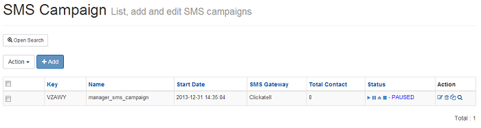
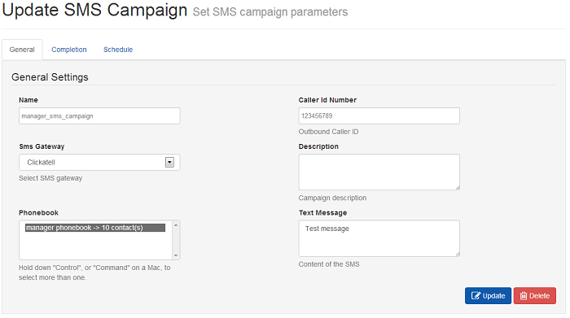

.. _customer-panel:

==============
Customer Panel
==============

Customer Panel URL : http://localhost:8000/admin/

This application provides a user interface for restricted management of
the User's Campaigns, Phonebooks and Subscribers. It also provides detailed
reporting of calls and message delivery.

.. contents::
    :local:
    :depth: 2

.. _customer-login:

Login Page
----------

Index page for the customer interface after successful login with user credentials

.. image:: ../_static/images/customer_screenshot.png
    :width: 750

.. _customer-phonebook-access:

Phonebook
---------

The phonebook list will be displayed from the following URL. You can add a new
phonebook by clicking ``Add phonebook`` and add the name of a phonebook and its
description. Also from the phonebook list, click on the phonebook to update.

**URL**:

    * http://localhost:8000/dialer_campaign/phonebook/

.. image:: ../_static/images/customer/phonebook_list.png
    :width: 700

To Add/Update a Phonebook for a logged in user

**URL**:

    * http://localhost:8000/dialer_campaign/phonebook/add/
    * http://localhost:8000/dialer_campaign/phonebook/1/

.. image:: ../_static/images/customer/update_phonebook.png

.. _customer-contact-access:

Contact
-------

The contact list will be displayed from following the URL. You can add a new contact
by clicking ``Add contact`` & adding the contact details (i.e. phone number, name,
description about contact, contact status) under the logged in user's phonebook from
the phonebook list. On the contact list, click on the contact to update.

**URL**:

    * http://localhost:8000/dialer_campaign/contact/

.. image:: ../_static/images/customer/contact_list.png

To Add/Update a contact in a phonebook

**URL**:

    * http://localhost:8000/dialer_campaign/contact/add/
    * http://localhost:8000/dialer_campaign/contact/1/

.. image:: ../_static/images/customer/update_contact.png

To import bulk contacts into a phonebook, click on ``Import``.
where you can upload contacts via a CSV file under a logged in
user's phonebook.

**URL**:

    * http://localhost:8000/dialer_campaign/contact_import/

.. image:: ../_static/images/customer/import_contact.png
    :width: 700

.. _survey-app:

Survey
------

The survey application for Newfies-Dialer allows polls and surveys to be taken over the phone.

Each contact is called, and then played a sound file. After the sound file is heard, the user can
enter their answer through the phone keypad using keys 0 to 9.

Therefore before creating the survey, the first job is to upload the audio for the survey. One audio
file is required for each question.

**Uploading Audio Files**:

Select Audio Files from the top menu then click add.

Enter a name to describe the audio, then click chose file, select the file you require from your
computer, then click submit.

Note that only mp3, Wav and ogg formats are supported.

The audio file will then be uploaded and renamed so that it is unique.

**Create the Survey**:

**URL**:

    * http://localhost:8000/survey/
    * http://localhost:8000/survey/add/
    * http://localhost:8000/survey/1/

.. image:: ../_static/images/customer/survey_list.png

Select Modules from the top menu, then Survey.

Click the add button, then give the survey a name and description, then click Submit.

A button will now appear to add a question.

In the question field, put in some text to describe the question - e.g "What is 1+1"; select the audio
file pertaining to the question which was uploaded in the previous step.

If no audio file is selected, then the system will automatically play the text in the question field
using the text to speech engine.

Then click Add Response. A further two fields will appear named Key Digit and Key Value. In key Digit
put a number from 0 to 9 which should be pressed for this answer. In the example "What is 1+1", "2"
should be placed in the Key Digit Field"

The Key Value field is used in the survey reports, and so in this case, you would put "Correct" as
1+1=2. You may chose to add responses 0,1 and 3 to 9 as key digits, with key values of "Wrong" as
these answers will then be summed up in the Survey Reports.

You can then go on to add another question, and its associated responses. On completion, click
Update Survey.

To use the Survey in a campaign, simply create a campaign as normal, and select the Survey name in
the Application drop-down.

**Survey Results**

When the survey is complete, the survey results can be inspected by clicking Reporting on the top
and selecting Survey Results from the drop-down.

.. _customer-campaign-access:

Campaign
--------

The campaign list will be displayed from the following URL. You can add a new campaign for
the logged in user by clicking ``Add campaign``. When adding a campaign, it is important
to add the campaign's start and end dates with time & week-day exceptions. Select
the gateway through which calls will be routed & phonebook(s) that are
linked with contacts from the campaign list, click on campaign to update.

**URL**:

    * http://localhost:8000/dialer_campaign/campaign/

.. image:: ../_static/images/customer/campaign_list.png
    :width: 800

To Add/Update a Campaign for a logged in user

**URL**:

    * http://localhost:8000/dialer_campaign/campaign/add/
    * http://localhost:8000/dialer_campaign/campaign/1/

.. image:: ../_static/images/customer/update_campaign.png
    :width: 800

.. _customer-dashboard-access:

Dashboard
---------

Dashboard gives the information anbout campaign & its related call records

.. image:: ../_static/images/customer/customer_dashboard.png
    :width: 800

.. _settings-user:

User Settings
-------------

The settings page provides a number of functions:

    * Account - Change the detail of the account.
    * Password - Change the password.
    * Notifications - Display system notifications.
    * Limitation - Displays the parameters of the dialer settings.
    * Authorized - Facitiy to check that a number is not blacklisted.

.. image:: ../_static/images/customer/account_setting.png

.. _customer-sms-campaign-access:

SMSCampaign
-----------

The sms campaign list will be displayed from the following URL. You can add a new sms campaign for
the logged in user by clicking ``Add sms campaign``. When adding a sms campaign, it is important
to add the campaign's start and end dates with time & week-day exceptions. Select
the sms gateway through which smses will be routed & phonebook(s) that are
linked with contacts from the sms campaign list, click on sms campaign to update.

**URL**:

    * http://localhost:8000/sms_campaign/

To Add/Update a SMS Campaign for a logged in user

**URL**:

    * http://localhost:8000/sms_campaign/add/
    * http://localhost:8000/sms_campaign/1/

