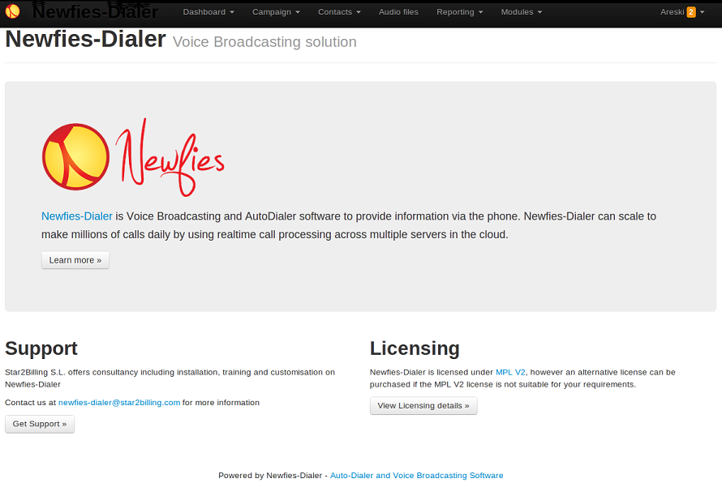
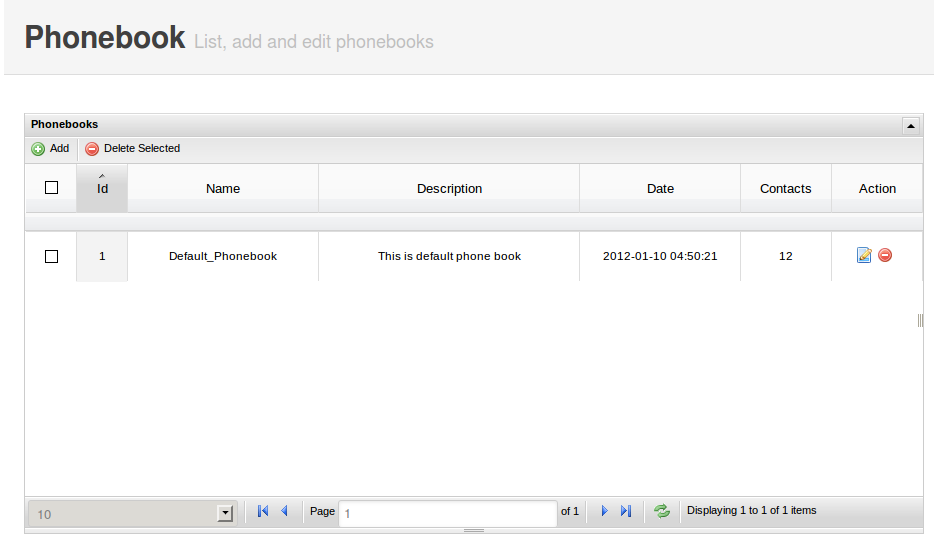
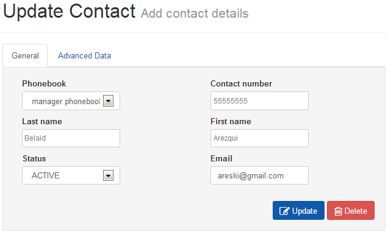

.. _customer-panel:

==============
Customer Panel
==============

User Interface :

http://localhost:8000/
This application provides a User interface for restricted management of
the User's Campaign, Phonebook, Subscriber. It also provides detailed
Reporting of calls and message delivery.

.. contents::
    :local:
    :depth: 1

.. _customer-screenshot-features:

Screenshot with Features
========================

Index
~~~~~

Index page for customer interface after successful login with user credentials 

.. _customer-phonebook-access:

Phonebook
~~~~~~~~~

Phonebook list will be displayed from following URL. You can add new phonebook
by clicking ``Add phonebook`` and add name of phonebook and its description.
Also from phonebook list, click on the phonebook that you want to update.

**URL**:

    * http://localhost:8000/dialer_campaign/phonebook/

To Add/Update phonebook for logged in user

**URL**:

    * http://localhost:8000/dialer_campaign/phonebook/add/
    * http://localhost:8000/dialer_campaign/phonebook/1/

.. image:: ../_static/images/customer/update_phonebook.png

.. _customer-contact-access:

Contact
~~~~~~~

Contact list will be displayed from following URL and you can add new contact
by clicking ``Add contact`` & add contact details (like phone number, name,
description about contact, contact status) under logged in user's phonebook from phonebook list.
From the contact list, click on contact that you want to update.

**URL**:

    * http://localhost:8000/dialer_campaign/contact/

.. image:: ../_static/images/customer/contact_list.png

To Add/Update contact for phonebook

**URL**:

    * http://localhost:8000/dialer_campaign/contact/add/
    * http://localhost:8000/dialer_campaign/contact/1/

To import bulk contacts into phonebook, click on ``Import``.
From where you can upload contacts via a CSV file under logged in user's phonebook.

**URL**:

    * http://localhost:8000/dialer_campaign/contact/import/

.. image:: ../_static/images/customer/import_contact.png

.. _customer-campaign-access:

Campaign
~~~~~~~~

Campaign list will be displayed from following URL. You can add new campaign for
the logged in user by clicking ``Add campaign``. While adding campaign, importantly
add the campaign's start and end dates with time & week-day exceptions.
Also select the gateway through which calls will be routed & phonebook(s) that are
linked with contacts.
From campaign list, click on campaign that you want to update.

**URL**:

    * http://localhost:8000/dialer_campaign/campaign/

.. image:: ../_static/images/customer/campaign_list.png

To Add/Update Campaign for logged in user

**URL**:

    * http://localhost:8000/dialer_campaign/campaign/add/
    * http://localhost:8000/dialer_campaign/campaign/1/

.. image:: ../_static/images/customer/update_campaign.png
