.. _how-to-use-it:

=========================
How to use Newfies-Dialer
=========================

Freeswitch Set-Up
-----------------
Configure trunks and gateways in Freeswitch by creating an XML file in 
/usr/local/freeswitch/conf/sip_profiles/external/ and give it an identifiable name, 
e.g. call-labs.xml, and place the following lines in the file, edited to suit your provider::

    <include>
    <gateway name="ip address or hostname of carrier">
    <!--/// account username *required* ///-->
    <param name="username" value="your username provided by carrier"/>
    <!--/// auth realm: *optional* same as gateway name, if blank ///-->
    <!--<param name="realm" value="asterlink.com"/>-->
    <!--/// username to use in from: *optional* same as username, if blank ///-->
    <param name="from-user" value="your username provided by carrier"/>
    <!--/// domain to use in from: *optional* same as realm, if blank ///-->
    <!--param name="from-domain" value=""/-->
    <!--/// account password *required* ///-->
    <param name="password" value="your password supplied by carrier"/>
    <!--/// extension for inbound calls: *optional* same as username, if blank ///-->
    <!--<param name="extension" value="cluecon"/>-->
    <!--/// proxy host: *optional* same as realm, if blank ///-->
    <!--<param name="proxy" value="asterlink.com"/>-->
    <!--/// send register to this proxy: *optional* same as proxy, if blank ///-->
    <!--<param name="register-proxy" value="mysbc.com"/>-->
    <!--/// expire in seconds: *optional* 3600, if blank ///-->
    <!--<param name="expire-seconds" value="60"/>-->
    <!--/// do not register ///-->
    <param name="register" value="true"/>
    <!-- which transport to use for register -->
    <!--<param name="register-transport" value="udp"/>-->
    <!--How many seconds before a retry when a failure or timeout occurs -->
    <!--<param name="retry-seconds" value="30"/>-->
    <!--Use the callerid of an inbound call in the from field on outbound calls via this gateway -->
    <!--<param name="caller-id-in-from" value="false"/>-->
    <!--extra sip params to send in the contact-->
    <!--<param name="contact-params" value="tport=tcp"/>-->
    <!--send an options ping every x seconds, failure will unregister and/or mark it down-->
    <!--<param name="ping" value="25"/>-->
    </gateway>
    </include>

Then in the Freeswitch CLI (fs_cli) “sofia profile external restart reloadxml”. When the command is 
complete, check the gateway has registered with the command “sofia status”.

Create Gateway
-----------------
Having created the gateway in Freeswitch, Newfies-Dialer has to be told that it can use it. In 
admin,  add a new dialer gateway, e.g. sofia/gateway/myprovider/ (The final / is important) where 
“myprovider” is the gateway name setting used in above xml file in Freeswitch.

Only the fields in bold are compulsory.

.. _dialer-settings:

Dialer Settings
---------------

Dialer settings are mapped with system users who are going to create campaigns & contacts. If dialer 
settings are not mapped to users, notifications & emails are sent to super admin user.

To create restrictions (like the Max. no of campaign, Max no of contacts etc.) for
system User, Click on ``Add dialer settings``. Add numeric values for the limit.

To apply the dialer settings limit on a system user, click on ``Customers`` or ``Admins`` 
in admin UI, select the user to update, & apply the settings from the dialer settings list.

.. _Voice App:

Create Voice Application
----------------------------

A number of voice applications are provided with Newfies-Dialer. Click ``Add Voice App`` give the
voice application a name, select the type of  application from the dropdown, select the gateway 
to use if the call is to be redirected, and provide the data to be used, e.g. in the case of “Speak” 
this would be the words to convert to text to speech.

.. _Survey:

Create Survey
-------------

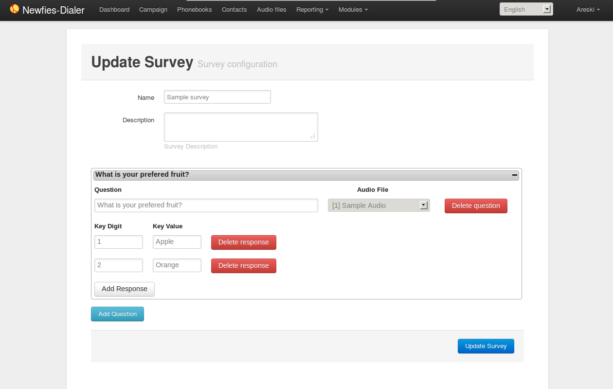

The survey application for Newfies-Dialer allows polls and surveys to be taken over the phone.

Each contact is called, and then played a sound file. After the sound file is heard, the user can
enter their answer through the phone keypad using keys 0 to 9.

Therefore before creating the survey, the first job is to upload the audio for the survey. One audio
file is required for each question.

**Uploading Audio Files**:

Select Audio Files from the top menu then click add.

Enter a name to describe the audio, then click chose file, select the file you require from your
computer, then click submit.

Note that only mp3, Wav and ogg formats are supported.

The audio file will then be uploaded and renamed so that it is unique.

**Create the Survey**:

**URL**:

    * http://localhost:8000/survey/
    * http://localhost:8000/survey/add/
    * http://localhost:8000/survey/1/

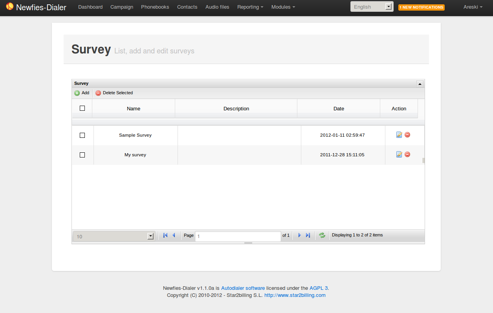

Select Modules from the top menu, then Survey. 

Click the add button, then give the survey a name and description, then click Submit.

A button will now appear to add a question.

In the question field, put in some text to describe the question - e.g "What is 1+1"; select the audio
file pertaining to the question which was uploaded in the previous step.

If no audio file is selected, then the system will automatically play the text in the question field 
using the text to speech engine.

Then click Add Response. A further two fields will appear named Key Digit and Key Value. In key Digit
put a number from 0 to 9 which should be pressed for this answer. In the example "What is 1+1", "2"
should be placed in the Key Digit Field" 

The Key Value field is used in the survey reports, and so in this case, you would put "Correct" as 
1+1=2. You may chose to add responses 0,1 and 3 to 9 as key digits, with key values of "Wrong" as 
these answers will then be summed up in the Survey Reports.

You can then go on to add another question, and its associated responses. On completion, click 
Update Survey.

To use the Survey in a campaign, simply create a campaign as normal, and select the Survey name in
the Application drop-down.
        

.. _call-list:

Create call list
----------------

To create a call list, click on ``Add`` in Phonebook list, add name of phonebook & its
description. Click on ``Contacts`` and add phone numbers in the contact list.
You can also import your call list from csv files, via clicking on
``Import contact``.

Update Phonebook:

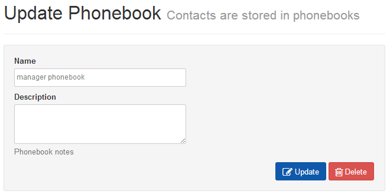

Contact List:

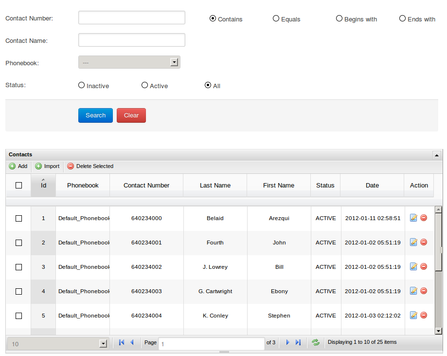

Import contact:

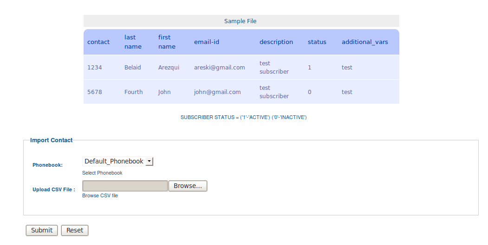

.. _campaign:

Create campaign
---------------

To create a campaign, click on ``Add`` in campaign list, add details for the campaign.
Important: Add the campaign's start and end dates with times & week-day
exceptions. Select the gateway through which calls will be routed & the phonebook(s)
linked with the contacts.

Campaign list:

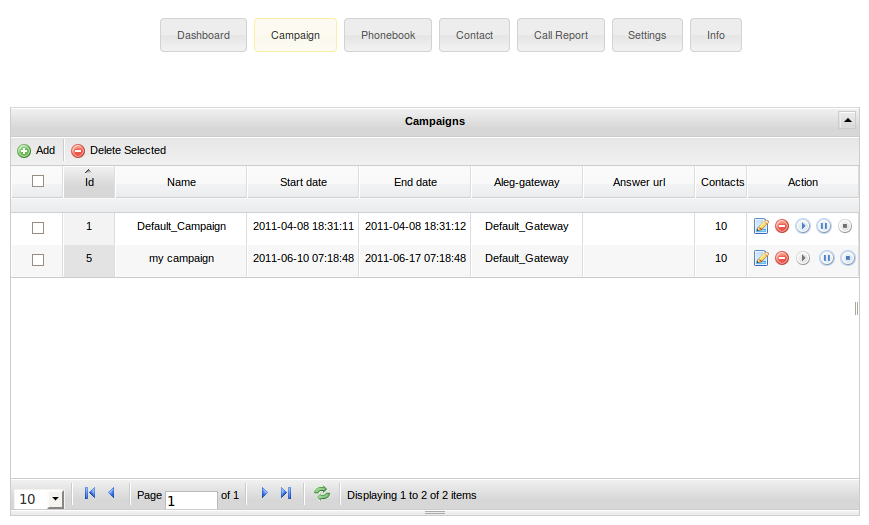

Update Campaign:

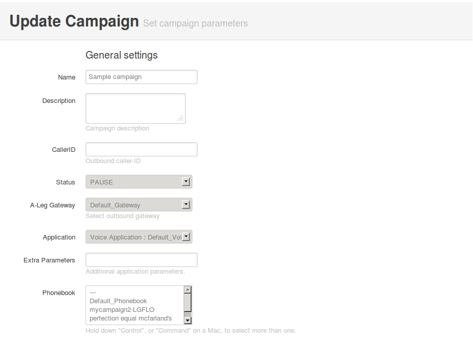

.. _apply-dialer-settings:

Dialer Settings
---------------

Dialer settings has to be mapped with system users who are going to create campaigns & contacts.
If dialer setting is not mapped with system users, notification & mail has been sent to Super admin user.

To create restrictions (like the Max. no of campaign, Max no of contacts etc.) for
system User, Click on ``Add`` in dialer settings list of admin side. Add numeric values for the limit.

To apply the dialer settings limit on a system user, click on ``Customers`` or ``Admins`` in admin UI,
select the user to update, & apply the settings from the dialer settings list.

Dialer settings:

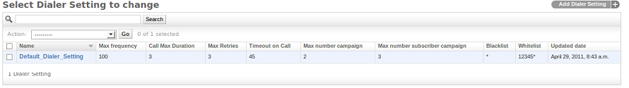

Update dialer settings:

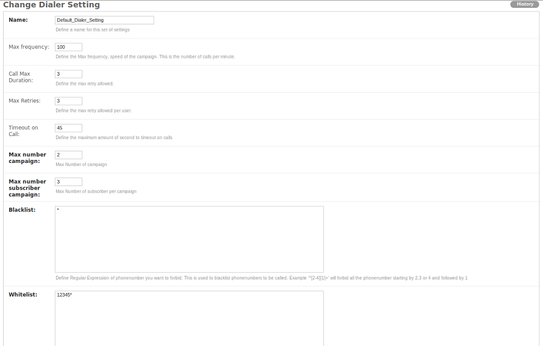

.. _reach-to-contact:

Call contacts/subscribers
-----------------------------

A call-request will spool a call directly from the platform using a dialer gateway
and update the call-request status after receiving a response from the gateway.

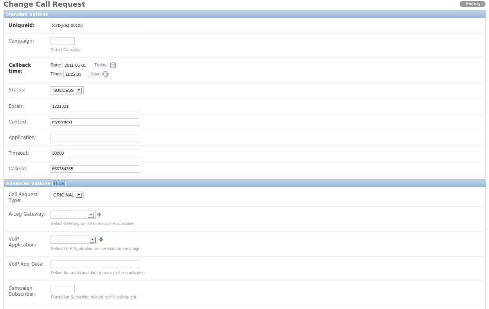

.. _call-report:

VoIP Call Report
----------------

As per the status of a call-request, it will be stored in the VoIP call records.
This gives information of all the calls & call statistics made with the call-request
and also you can search for records on the basis of date range. You can export the VoIP
call report into a csv file.

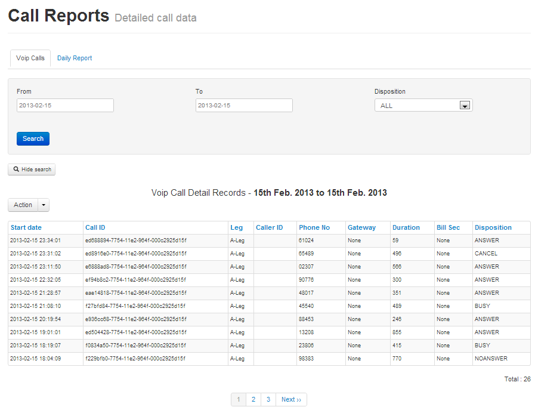

.. _survey-report:

Survey Report
-------------

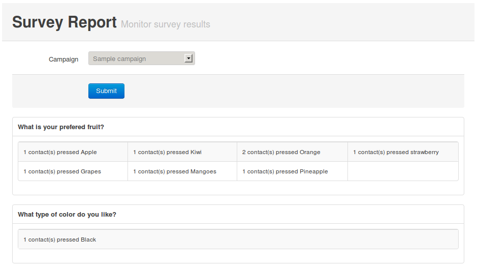

When the survey is complete, the survey results can be inspected by clicking Reporting on the top 
and selecting Survey Results from the drop-down.

.. _Settings:

Settings
--------

The settings page provides a number of functions:

    * Account - Change the detail of the account.
    * Password - Change the password.
    * Notifications - Display system notifications.
    * Limitation - Displays the parameters of the dialer settings.
    * Authorized - Facitiy to check that a number is not blacklisted.

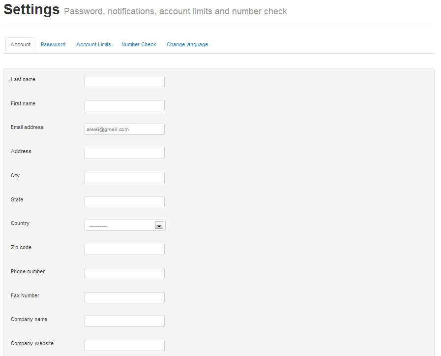