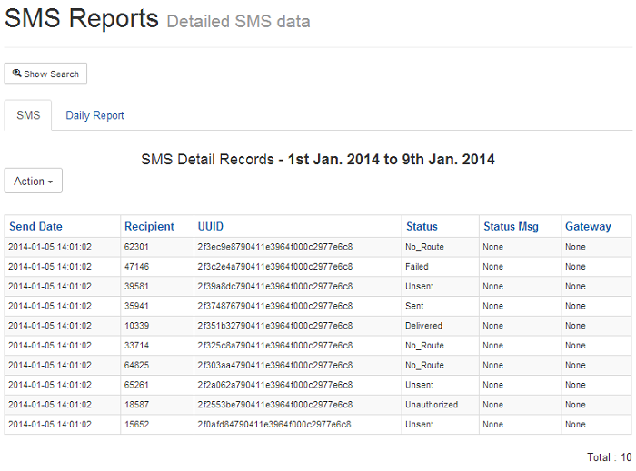
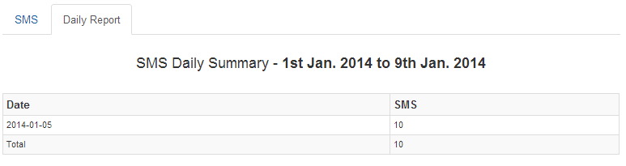

============
SMS Campaign
============

Creating an SMS campaign is straight-forward in Newfies-Dialer and is usually done via the customer interface.

Create a Phonebook
==================

The first step is to create a phone book consisting of the SMS contacts to be called. Click Contact at the top, then Phonebooks on the side menu, add a new Phonebook and give it a name, for instance SMS-PB1

Add or Import Contacts
======================

Manually add or import contacts to the phone book created in the previous step. Note that most SMS providers require you to properly format the numbers into IETF format, that is to say, +1234567890 rather than 001234567890 or 0111234567890.

Add SMS Campaign
================

Click Campaign on the top menu, then select SMS Campaign from the dropdown.

Click Add and fill in the fields:

 - *Name:* A descriptive name for the Campaign
 - *Caller ID Number:* The number to deliver as the caller ID
 - *SMS Gateway:* Select the gateway to use for the campaign
 - *Description:* Notes on the campaign
 - *Phonebook:* Select one or more phone books containing the contacts to call
 - *Text Message:* Enter the message to be sent, with no more than 160 characters.

 Tag Replacement can be used here to personalise the message, e.g. Hello {first_name} {last_name} will replace whatever you have in the first and last name fields against the contact.

At this point the campaign could be saved and sent, however there are a number of other parameters that can be adjusted:

Completion
----------

Under the completion tab:

 - *Frequency:* Number of SMS's to send per minute.
 - *Time Between Retries:* If a message delivery fails, wait this number of seconds before retrying.
 - *Max Retries:* Number of times to re-attempt message delivery.

**URL**:

    * http://localhost:8000/sms_campaign/add/
    * http://localhost:8000/sms_campaign/1/

.. image:: ../_static/images/customer/update_sms_campaign.png
    :width: 800

Schedule
--------

Under the Schedule Tab

It may not be desirable to send SMS messages during weekends or out of hours, so the daily start and stop time can be set as well as the days of the week to send messages.

There is also a start and stop date as to when it is valid to send the campaign.

When all the settings are as required, then the survey can be saved and started by clicking the play button.

Reporting
=========

To view the SMS reports, click reporting then SMS reports on the side menu. The call data records for SMS messages are listed under the SMS tab, while a daily report shows the number of SMS's sent by day.

Records can be filtered on date, status and campaign.

SMS CDR can be exported in CSV, XML and Excel formats.

**URL**:

    * http://localhost:8000/sms_report/

