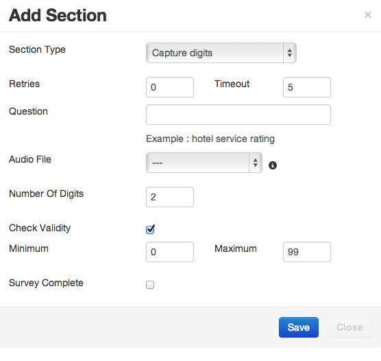
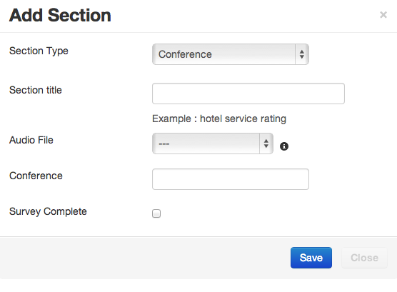
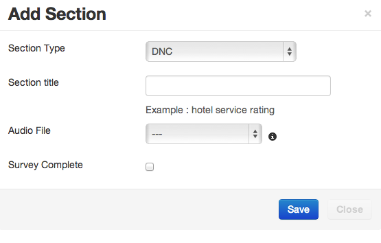
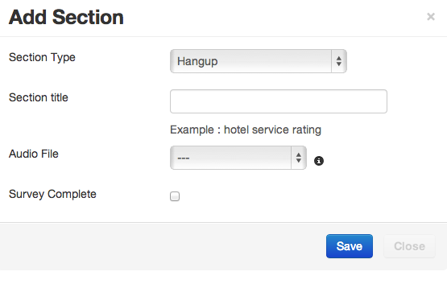
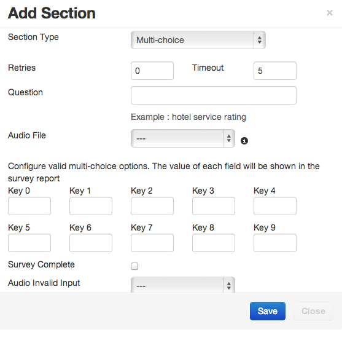
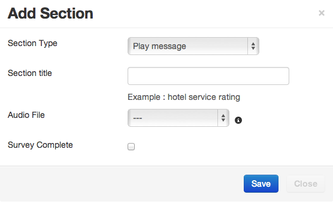
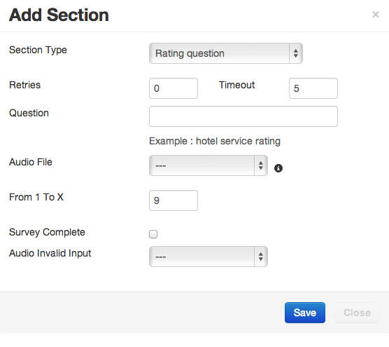
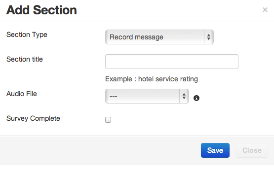

.. _survey-nodes:

============
Survey Nodes
============

.. contents::
    :local:
    :depth: 2

Most survey nodes have similar attributes that include:

 - Section Title, the title of the section and becomes the TTS (text To Speech)
 - Audio File, The sound file to be played for this node.
 - Retries, if no valid input, then the question can be asked again.
 - Timeout, the amount of time before it is considered that no input has been received.
 - Check Validity, whether the answer is deemed valid.
 - Audio Invalid Input, The audio to play when invalid input is received.
 - Survey Complete, check this field to mark the survey is complete for reporting & retry purposes.

.. _call-transfer:

Call Transfer
-------------

Used for "press one" campaigns and live lead generation. This node bridges the call to the number in the Phone Number field when the contact answers.

The field can have a telephone number or something like sofia/gateway/my.gateway/12345 which will direct the call via a specified gateway (my.gateway) to number 12345.

.. image:: ../_static/images/customer/node_call_transfer.png

.. _capture-digits:

Capture Digits
--------------

Captures a series of digits, e.g. a telephone number or account number and stores it in the reporting. The number of digits and the minimum and maximum values can be set.

.. _conference-node:

Conference
----------

Set up a conference with outbound calls. The default conference number in Freeswitch is 9888. The Freeswitch dialplan can be adjusted to add more conferences.

.. _dnc-list:

DNC
---

Do Not Call node, which will add the called contact to the DNC list configured in the campaign.

.. _hangup-node:

Hangup
------

Hang up the call at the end of the survey.

.. _multi-choice-node:

Multi-Choice
------------

Multi-Choice offering options 0 to 9. The value placed in the "Key X" fields appears in the survey reports.

Survey branching can be used to control the flow of the IVR depending on the key pressed.

.. _play-message:

Play Message
------------

Play message is simply to play a message, either with TTS or pre-recorded audio.

.. _rating-question:

Rating Question
---------------

Rating allows the entry of a digit or digits from 1 to X, where X is a number you select.

.. _record-message:

Record Message
--------------

Record a message, the system stops recording after 3 seconds of silence, or by pressing the # key. The IVR flow will then continue.

Recordings can be listened to in the survey reports menu.
